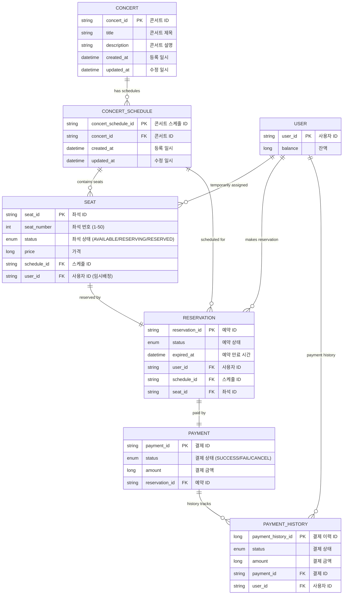

# 🎵 콘서트 예약 서비스 ERD

## 📊 시스템 개요

| 구분 | 개수 |
|------|------|
| 전체 Entity | 7개 |
| 도메인 | 4개 |
| 관계 | 8개 |

## 🗃️ Entity Relationship Diagram



## 🏗️ 도메인별 Entity 상세

### 🎵 콘서트 도메인

#### CONCERT
| 필드명 | 타입 | 설명 |
|--------|------|------|
| **concert_id** (PK) | String | 콘서트 ID |
| title | String | 콘서트 제목 |
| description | String | 콘서트 설명 |
| created_at | LocalDateTime | 등록 일시 |
| updated_at | LocalDateTime | 수정 일시 |

#### CONCERT_SCHEDULE
| 필드명 | 타입 | 설명 |
|--------|------|------|
| **concert_schedule_id** (PK) | String | 콘서트 스케줄 ID |
| **concert_id** (FK) | String | 콘서트 ID |
| created_at | LocalDateTime | 등록 일시 |
| updated_at | LocalDateTime | 수정 일시 |

#### SEAT
| 필드명 | 타입 | 설명 |
|--------|------|------|
| **seat_id** (PK) | String | 좌석 ID |
| seat_number | int | 좌석 번호 (1-50) |
| status | SeatStatus | 좌석 상태 (AVAILABLE/RESERVING/RESERVED) |
| price | Long | 가격 |
| **schedule_id** (FK) | String | 스케줄 ID |
| **user_id** (FK) | String | 사용자 ID (임시배정) |

### 👤 사용자 도메인

#### USER
| 필드명 | 타입 | 설명 |
|--------|------|------|
| **user_id** (PK) | String | 사용자 ID |
| balance | Long | 잔액 |

### 📋 예약 도메인

#### RESERVATION
| 필드명 | 타입 | 설명 |
|--------|------|------|
| **reservation_id** (PK) | String | 예약 ID |
| status | ReservationStatus | 예약 상태 |
| expired_at | LocalDateTime | 예약 만료 시간 |
| **user_id** (FK) | String | 사용자 ID |
| **schedule_id** (FK) | String | 스케줄 ID |
| **seat_id** (FK) | String | 좌석 ID |

### 💳 결제 도메인

#### PAYMENT
| 필드명 | 타입 | 설명 |
|--------|------|------|
| **payment_id** (PK) | String | 결제 ID |
| status | PaymentStatus | 결제 상태 (SUCCESS/FAIL/CANCEL) |
| amount | Long | 결제 금액 |
| **reservation_id** (FK) | String | 예약 ID |

#### PAYMENT_HISTORY
| 필드명 | 타입 | 설명 |
|--------|------|------|
| **payment_history_id** (PK) | Long | 결제 이력 ID |
| status | PaymentStatus | 결제 상태 |
| amount | Long | 결제 금액 |
| **payment_id** (FK) | String | 결제 ID |
| **user_id** (FK) | String | 사용자 ID |

## 🔗 Entity 관계

| 관계 | 카디널리티 | 설명 |
|------|------------|------|
| CONCERT → CONCERT_SCHEDULE | 1:N | 하나의 콘서트는 여러 스케줄을 가질 수 있음 |
| CONCERT_SCHEDULE → SEAT | 1:N | 하나의 스케줄은 여러 좌석을 포함함 |
| USER → SEAT | 1:N | 사용자는 여러 좌석을 임시 배정받을 수 있음 |
| USER → RESERVATION | 1:N | 사용자는 여러 예약을 할 수 있음 |
| USER → PAYMENT_HISTORY | 1:N | 사용자는 여러 결제 이력을 가질 수 있음 |
| CONCERT_SCHEDULE → RESERVATION | 1:N | 하나의 스케줄에는 여러 예약이 있을 수 있음 |
| SEAT → RESERVATION | 1:1 | 하나의 좌석은 하나의 예약과 연결됨 |
| RESERVATION → PAYMENT | 1:1 | 하나의 예약은 하나의 결제와 연결됨 |
| PAYMENT → PAYMENT_HISTORY | 1:N | 하나의 결제는 여러 이력을 가질 수 있음 |

## 📋 Enum 정의

### SeatStatus
```java
public enum SeatStatus {
    AVAILABLE,    // 예약 가능
    RESERVING,    // 임시 예약 중
    RESERVED      // 예약 완료
}
```

### PaymentStatus
```java
public enum PaymentStatus {
    SUCCESS,      // 결제 성공
    FAIL,         // 결제 실패
    CANCEL        // 결제 취소
}
```

---

**Generated:** `2025-08-28`  
**Project:** HangHae Plus Concert Reservation System